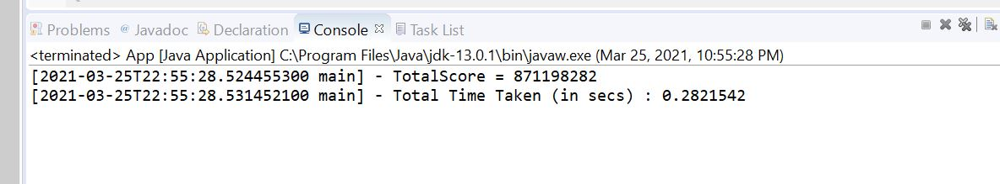

# occnamescorer

## Name Scorer Project Overview
*   This project is to calculate the scores from the list of names. The input is a file with first names and the output is a total score calculated form the names. The project is a maven project created on eclipse. pom.xml contains all the configuration details, dependenses, and build goals. The application is able to run on both eclipse and command line.

*   Java 8+
*   Maven 3.6.3
*   eclipse

## Git Repo
*   Souce Code URL  https://github.com/yzhouyzhou/occnamescorer

## Project Specification
*   To score a list of names, sort it alphabetically and sum the individual scores 
for all the names. To score a name, sum the alphabetical value of each letter (A=1, B=2, 
C=3, etc...) and multiply the sum by the name’s position in the list (1-based).
For example, when the sample data below is sorted into alphabetical order, LINDA, 
which is worth 12 + 9 + 14 + 4 + 1 = 40, is the 4th name in the list. So, LINDA would 
obtain a score of 40 x 4 = 160.

## User Cases
*   Input a source file from command line;
*   Sort them alphabetically
*   Calculation algorithm: 
    *   score name 
    *   its position
    *   calculate total
*   Output to display
*   Exception error handling

# Design Pattern and Interface
*   Composite Pattern.
*   Abstract Factory Pattern.
*   Input file reading interface to leave the data resource open.
*   Calculation interface to derive other future calculation strategies.

# Testing
*   unit test case
*   performance test case
    
# Utility
*   log utility
*   StopWatch wrapper to measure overall application performance

# Future Development - Phase II
*   There are a few limitations with current phase. For next phase, we can make improvements:
    *   The scoring feature can be added as a web-app
    *   Switching from first names only to both first and last names

## Output

*   Output from eclipse is showed as following:
   
    *   Outputs with samples.txt

        
    

    *   Outputs with names.txt, 

        

    *   Outputs with a bad file with exception error handling

        

    *   6 unit test cases were created including 1 performance test. 

        

*   Output from command line is showed as following:

    *   mvnbuild.sh is a shell scripts, which is able to make a maven clean build, and copy the jar file to the proper place.  Build log is written to the file [build.output.txt](https://github.com/yzhouyzhou/occnamescorer/blob/main/build.output.txt). 

        

    *   With a success build, you can using this command to run the application:

        java -classpath ./jars/* com.occ.namescorer.App names.txt

        

*   All the sulution is built based on Java version 13.0.1 and Maven version 3.6.3:

       

