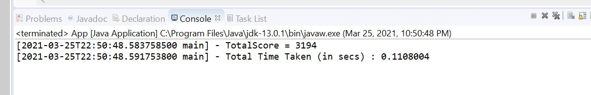
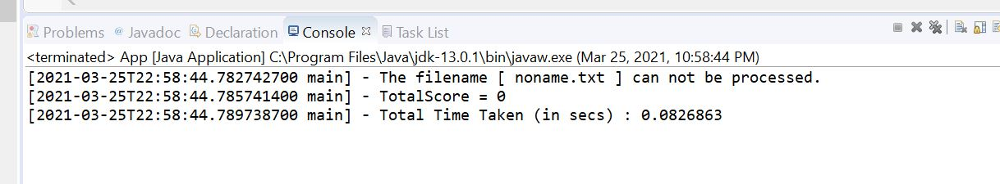
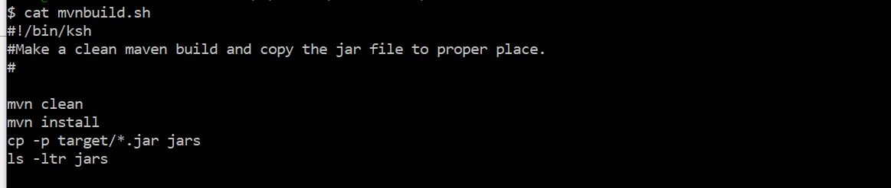
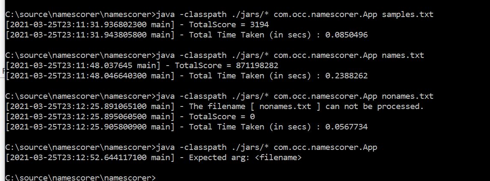

# occnamescorer

Name Scorer Project

*   Souce Code URL https://github.com/yzhouyzhou/occnamescorer

*   This project is a maven project created on eclipse. pom.xml contains all the dependenses. 

*   Output from eclipse is showed as following:
   
    *   Outputs with samples.txt

        
    

    *   Outputs with names.txt, 

        

    *   Outputs with a bad file with exception error handling

        

    *   6 unit test cases were created including 1 perftest. 

        

*   Output from command line is showed as following:

    *   mvnbuild.sh is a shell scripts, which is able to make a maven clean build, and copy the jar file to the proper place.  Build log is written to the file build.output.txt. 

        

    *   With a success build, you can using this command to run the application:
        java -classpath ./jars/* com.occ.namescorer.App

        

